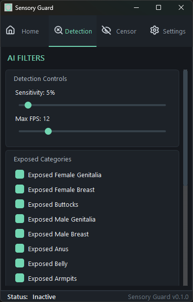

<div align="center">
	
	<h1>Sensory Guard</h1>
	<p>
		<a href="https://github.com/khde/sensory-guard/releases/latest"><strong>Download latest release</strong></a>
		&middot;
		<a href="https://github.com/khde/sensory-guard/releases"><strong>All releases</strong></a>
	</p>
</div>

<p align="center">
	<a href="#features">Features</a> &middot;
	<a href="#installation">Installation</a> &middot;
	<a href="#license">License</a>
</p>

Sensory Guard is an offline, real-time NSFW screen censor desktop application that uses an on-device machine learning model to detect and censor sensitive content live on the screen.

<p align="center">
	
</p>

## Features

- Live screen capture, content detection, and on-screen censoring
- Selectable content categories, sensitivity and processing rate
- Different censor styles: Solid, blur, and pixelation
- CPU inference, with DirectML GPU support on Windows

## Dependencies

The application is built with:

- Qt
- OpenCV
- ONNX Runtime

## Installation

### Linux

Currently, Linux screen capture is only supported on X11.

### Limitation

> [!WARNING]
> X11 and Wayland currently have no equivalent to Windows' `SetWindowDisplayAffinity`, which keeps the censor overlay out of screen capture. As a result, the model sees the censor overlay instead of the underlying content, causing feedback flickering, so censoring does not work reliably on Linux.

### Install dependencies

Install the compiler, build tools, Qt, OpenCV, ONNX Runtime and X11 development packages:

```bash
sudo apt update
sudo apt install -y qt6-base-dev libopencv-dev libx11-dev libxext-dev libonnxruntime-dev
```

### Build

Run these commands from the repository root:

```bash
cmake -S . -B build
cmake --build build
```

### Run

```bash
./build/SensoryGuard
```

## Windows

### Install dependencies

From the repository root, install the manifest dependencies for the 64-bit Windows triplet:

```powershell
& "$env:VCPKG_ROOT\vcpkg.exe" install --triplet x64-windows
```

This installs Qt, OpenCV, and ONNX Runtime from [vcpkg.json](vcpkg.json).

### Configure and build

Configure CMake with the vcpkg toolchain file:

```powershell
cmake -S . -B build `
	-DCMAKE_TOOLCHAIN_FILE="$env:VCPKG_ROOT\scripts\buildsystems\vcpkg.cmake" `
	-DVCPKG_TARGET_TRIPLET=x64-windows
```

Build the Release configuration:

```powershell
cmake --build build --config Release --parallel
```

### Run

```powershell
.\build\Release\SensoryGuard.exe
```

## License

Sensory Guard is licensed under the MIT License. See [LICENSE](LICENSE) for the full license text.
